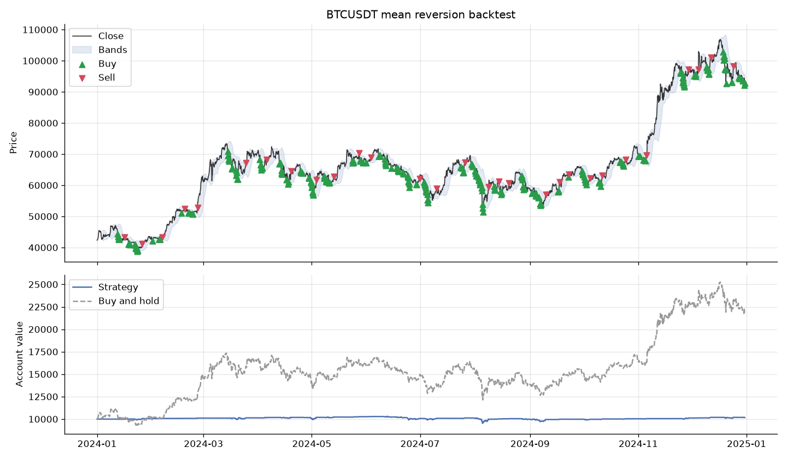

<h1 align="center">bollinger-paper-bot</h1>

<p align="center">
  A small paper trading bot for Binance that I wrote in 2024,<br>
  mostly to practice Python and learn a bit about trading.
</p>

<p align="center">
  
  <a href="https://github.com/Mounarkk/bollinger-paper-bot/actions/workflows/ci.yml"></a>
  
</p>

<p align="center">
  
</p>

## About

This was an educational side project. I wanted to write something bigger than a
single Python script, and I was curious about how trading bots work, so I tried
to build one. It's how I learned about candles, moving averages, Bollinger bands,
backtesting, and why fees matter more than you'd think.

It's very naive. The strategy is one of the simplest you can find, and the bot
never places a real order. It only simulates trades on real market data from
Binance. Please don't use it with real money, and don't take anything here as
financial advice.

## How it works

The strategy uses Bollinger bands. It takes the average close of the last 20
candles and draws two bands 1.5 standard deviations above and below it. When the
price closes under the lower band the bot buys with 2% of its cash, and when it
closes above the upper band it sells the whole position. The idea is that the
price tends to come back to its average. That works in a sideways market and
not at all in a strong trend.

The code is split into small services:

```
DataHandler -> Strategy -> RiskManager -> ExecutionManager -> Portfolio
```

DataHandler downloads the candles, Strategy turns them into buy and sell
signals, RiskManager decides how much to trade, ExecutionManager simulates the
order and Portfolio keeps track of the cash and positions. TradingEngine
connects them.

There are two modes. The backtest replays past candles. A signal is only known
once its candle has closed, so the trade is made at the open of the next candle,
and the backtest never uses a price it couldn't have known at the time. The live
mode polls Binance, trades once per closed candle, and saves the portfolio in
`state.json` so it can pick up where it stopped.

To try another strategy, subclass `Strategy` in `services/strategy.py` and
return 1 to buy, -1 to sell or 0 to do nothing for each candle.

## Results

Here is a backtest on BTCUSDT with 4 hour candles over 2024, starting with
10 000 USDT and paying 0.1% of fees per trade.

| | |
|---|---|
| Strategy return | +1.7% |
| Buy and hold return | +118.5% |
| Max drawdown | -7.7% |
| Trades | 308, and 29 of them closed a position |
| Win rate | 83% |
| Fees paid | 98.71 USDT |

The bot made money on 83% of the positions it closed and still ended up with
almost nothing, because each win is tiny and the fees eat part of it. 2024 was
also a great year for Bitcoin. The bot kept selling on the way up, while simply
buying and holding more than doubled the money. And since it only spends 2% of
its cash per buy, most of the account is never invested anyway.

## Running it

You need Python 3.11 or newer.

```bash
git clone https://github.com/Mounarkk/bollinger-paper-bot.git
cd bollinger-paper-bot
python -m venv venv && source venv/bin/activate
pip install -r requirements.txt
```

To run a backtest and save the chart:

```bash
python main.py backtest BTCUSDT --interval 4h --start 2024-01-01 --end 2024-12-31 --plot backtest.png
```

To paper trade on live data (stop it with Ctrl+C, the portfolio is saved in `state.json`):

```bash
python main.py live BTCUSDT --interval 1h
```

`python main.py backtest --help` shows the other options, like the band width or the fee.

You don't need an API key, the bot only uses public data. If you ever add
something that needs one, copy `.env.example` to `.env` (git ignores it) and
create a key with read access only, restricted to your IP.

## Tests

```bash
pip install -r requirements-dev.txt
pytest
ruff check .
```

The tests run on fake candles, so they don't need an internet connection.

## Limitations

Apart from the strategy itself, orders are filled instantly at the candle price
with no spread or slippage, the bot trades one pair at a time and can't short,
and there's no stop loss even though there's a class called RiskManager. The live
mode is only a simulation too, there's no code at all that sends real orders.

## License

MIT, see [LICENSE](LICENSE).
